<div align="center">

# 🥷 SploitAgent

**Security skills for AI agents.**
161 offensive + defensive techniques your AI agent loads on demand to work an **authorized** target — from recon to report.

[](https://github.com/NoorQureshi/SploitAgent/actions/workflows/ci.yml)


<sub>[Docs](https://noorqureshi.github.io/SploitAgent/) · [How it works](https://noorqureshi.github.io/SploitAgent/interact.html) · [Search skills](https://noorqureshi.github.io/SploitAgent/catalog.html) · [Contributing](CONTRIBUTING.md)</sub>

</div>

<p align="center">
  
</p>

**Benchmarked, not just claimed.** That replay is a real run: against OWASP Juice Shop (116 challenges, running locally), an agent with these skills solved **9 challenges in 10 minutes** — SQLi auth bypass, UNION credential dump, XXE, JWT algorithm confusion, BOLA — each with a written finding. Scoring comes from the target's own solve log, never from what the agent claims. Full A/B (skills vs none) and how to reproduce it yourself: [bench/RESULTS.md](bench/RESULTS.md).

## What it is

Your AI agent is a strong generalist, but it doesn't know the *exact method* for a specific job — say, testing an API for access-control bugs. **SploitAgent is that missing know-how:** a binder of 161 short "how to do this one technique" pages the agent flips to when it needs one.

You describe the task in plain English → it picks the right page, runs it, proves the bug, and writes it up → and it never touches anything outside the scope you set.

## Pick your door

Same library, five ways in. Everything below runs in your terminal — install once (Quickstart), then talk to your agent.

| You are… | You type… | What the agent does |
|---|---|---|
| **Bug bounty hunter** | "target.com is in scope on my program — assess it" | `tradecraft-scope-roe` confirms the boundary → `recon-*` maps the surface → the surface checklist drives coverage → confirmed bugs are written up submission-ready with `reporting-bug-bounty-writeup`, and `tradecraft-duplicate-avoidance` warns you before you burn time on known-dup classes |
| **CTF player** | "help me solve this challenge" (web / pwn / crypto / rev) | loads the technique page for the category (`web-*`, `exploit-*`, `cryptography-*`, `reverse-engineering-*`) and works the full variation matrix instead of quitting after one failed payload |
| **Pentester** | "assess this app per our signed scope" | plans with `tradecraft-attack-scenarios`, works the checklist as a **coverage map** — every class marked proved, ruled out (with what was tried), or skipped — then `reporting-pentest-report` writes it up |
| **Red teamer** | "I have a foothold on this AD domain (authorized)" | `privesc-*` to escalate, `ad-*` (Kerberoasting, ADCS, delegation, DACL abuse) to move, `network-pivoting-tunneling` to spread, `tradecraft-attack-path-mapping` to see the whole route |
| **Blue team / defender** | "write detections for these attacks" | `defense-*` covers detection engineering, Sigma rules, log queries, IR triage, hardening — `defense-purple-team` turns any attack skill into a detection test, and the top attack skills ship with `detection.md` companions (Sigma rule + log sources + false-positive tuning) |

## Quickstart

> **Need:** an AI agent — [Claude Code](https://claude.com/claude-code), [OpenCode](https://opencode.ai), Codex, Gemini, or your own API script — plus `git` and a terminal. `python3` only for the optional console.

```console
# 1 · install once — links the skills into your agent + puts `sploit` on PATH
$ git clone https://github.com/NoorQureshi/SploitAgent && cd SploitAgent
$ ./sploit install

# 2 · make a workspace for your target (anywhere) and set the boundary
$ sploit new acme.com ~/work/acme
$ cd ~/work/acme
$ nano scope.txt                     # your authorized target(s) — nothing else gets touched

# 3 · (optional) watch the agent work, live, in your browser
$ sploit watch                       # runs in the background · stop: sploit watch --stop

# 4 · open your agent in the workspace and describe the task   ↓ (Claude Code / OpenCode below)
```

**How the pieces fit:** your **terminal** runs the agent; everything it decides, tries, and proves lands in the **workspace folder** (`scope.txt · plan.md · notes.md · findings/`) — the source of truth you can read, diff, and hand to a client. Same flow with any agent; none of it is Claude-specific.

## Run it with your agent

Open your agent **inside the workspace** and describe the task in plain English — the matching skill loads itself.

<details open>
<summary><b>Claude Code</b></summary>

```console
~/work/acme $ claude          # skills are already in ~/.claude/skills — auto-discovered everywhere

> Start an authorized assessment of acme.com. Confirm scope, then recon.

  ● tradecraft-scope-roe        loaded · scope confirmed (*.acme.tld)
  ● recon-subdomain-enum        14 hosts · api.acme.tld live
  ● api-bola                    testing object references on /api/v1/orders
      ✓ cross-tenant read confirmed with 2 accounts
  ✔ wrote findings/idor-orders.md
```

`./sploit install` linked the skills into `~/.claude/skills/`, so Claude Code finds them in **any** folder and loads the one that fits your request.
</details>

<details>
<summary><b>OpenCode</b></summary>

```console
~/work/acme $ opencode        # launches the TUI in this folder, using your own model/API key

> Use the SploitAgent skills in ./skills. Start an authorized assessment of
  acme.com — confirm scope from scope.txt, then recon the attack surface.

  → reads AGENTS.md + ./skills · loads recon-* then routes by what it finds
```

No install step: OpenCode reads `AGENTS.md` and the `./skills` folder in the workspace automatically. (First time: `opencode auth login` to set your provider/API key.)
</details>

<details>
<summary><b>Codex · Gemini · any other agent / your own API script</b></summary>

```console
~/work/acme $ codex           # or: gemini  — run inside the workspace

> Use the SploitAgent skills here. Start an authorized assessment of acme.com,
  confirm scope from scope.txt, then recon.
```

Any agent works: point it at the workspace with read access to `AGENTS.md` and `./skills`, or paste a single `SKILL.md` into the chat for a one-off. Nothing to wire up.
</details>

<details>
<summary><b>Optional: watch the agent live in your browser (<code>sploit watch</code>)</b></summary>

The terminal is the whole workflow — but if you want a live, **read-only** view of what the agent is doing, `sploit watch` opens a small dashboard at `http://127.0.0.1:8787`. It just reads the workspace on disk, so it works the same whichever agent you run.

<p align="center">
  
</p>
<p align="center">
  
  &nbsp;
  
</p>

- **Attack Map** — the whole engagement as a decision graph: what was proved, ruled out, blocked, and skipped — and *why*.
- **Findings** — each confirmed issue rendered and ready to submit · **Activity** — a live, filterable timeline with the reasoning · **Plan / Notes** — the strategy and running log.

Under Claude Code a bundled hook records commands automatically, so the console fills in even if the agent doesn't log by hand.
</details>

## Ask it anything

| You type… | The agent loads |
|---|---|
| "recon acme.com and map the attack surface" | `recon-*` |
| "test this API for IDOR / BOLA (I'm authorized)" | `api-bola`, `web-idor` |
| "is this login's JWT forgeable?" | `web-auth-jwt` |
| "review ./src for injection bugs" | `code-review-*` |
| "I got a shell — what now?" | `privesc-enumeration` |
| "turn this finding into a report" | `reporting-*` |
| "write a Sigma rule to detect this" | `defense-detection-sigma` |

## What's inside

**161 skills across 20 domains.** [🔎 Search them all](https://noorqureshi.github.io/SploitAgent/catalog.html) · or browse [CATALOG.md](CATALOG.md).

`web` · `api` · `cloud` · `ad` · `network` · `wireless` · `recon` · `mobile` · `ai-ml` · `code-review` · `reverse-engineering` · `cryptography` · `exploit-dev` · `privesc` · `payloads` · `defense` · `reporting` · `automation` · `tradecraft` · `social-eng`

<details>
<summary><b>See what each domain covers</b></summary>

| Domain | # | Covers |
|---|:--:|---|
| [`web`](skills/web) | 44 | XSS, SQLi, SSRF, SSTI, IDOR, XXE, CSRF, CORS, LFI, command injection, deserialization, OAuth, SAML, request smuggling, prototype pollution, cache poisoning, cache deception, host-header, clickjacking, CSP bypass, DOM clobbering, HTTP parameter pollution, postMessage, WebSocket, race conditions, business logic, file upload, JWT, 2FA/MFA bypass, account takeover, dependency confusion, client-side signing reversal, authenticated session handling, Python sandbox escape, Cypher injection, JDBC/connection-string RCE |
| [`ai-ml`](skills/ai-ml) | 9 | Prompt injection, jailbreaks, RAG poisoning, model extraction, agent/tool and MCP abuse, insecure output handling, supply chain, unbounded consumption |
| [`cloud`](skills/cloud) | 9 | IMDS credential theft, object-storage exposure, Kubernetes, container escape, exposed Docker/daemon API abuse, IAM privilege escalation, registries, GCP, Azure / Entra ID |
| [`api`](skills/api) | 9 | BOLA/BFLA, GraphQL, gRPC, mass assignment, authentication attacks, fuzzing, version drift, NoSQL injection |
| [`recon`](skills/recon) | 9 | Subdomain enumeration, DNS analysis, content and JS discovery, OSINT, GitHub code-leak discovery, cloud-asset discovery, service enumeration, tech-stack fingerprinting |
| [`defense`](skills/defense) | 13 | Detection engineering (pipeline + Sigma/ATT&CK), threat hunting, incident response, DFIR triage, network detection (NSM), cloud detection & response, Active Directory defense, malware triage, hardening baselines, threat modeling, log analysis, purple teaming |
| [`code-review`](skills/code-review) | 15 | Methodology, dangerous-sink catalog, secrets detection, CI/CD security, IaC (Terraform/Ansible/K8s), smart contracts (Solidity), Python, Node.js, PHP, Java/Spring, Go, Ruby/Rails, .NET/C#, C/C++, Rust |
| [`mobile`](skills/mobile) | 5 | Android and iOS assessment, certificate-pinning bypass, deep-link abuse, WebView abuse |
| [`ad`](skills/ad) | 5 | Kerberoasting / AS-REP, ADCS (ESC1–8), ACL/DACL abuse, Kerberos delegation abuse (RBCD / S4U / coercion→relay), pivoting arsenal |
| [`network`](skills/network) | 6 | Service attacks, pivoting and tunneling, NTLM coercion and relay, password spraying and credential stuffing, perimeter appliance and VPN offensive, hash and credential cracking |
| [`wireless`](skills/wireless) | 2 | WPA2-PSK handshake/PMKID capture and cracking, evil-twin / rogue-AP enterprise (PEAP-MSCHAPv2) credential harvesting |
| [`privesc`](skills/privesc) | 4 | Post-foothold enumeration and credential hunting, Linux arsenal, GTFOBins (sudo/SUID/capabilities), Windows token impersonation |
| [`exploit-dev`](skills/exploit-dev) | 3 | Exploit chaining and impact amplification, PoC development, memory-corruption exploitation (ROP / format string / ret2libc) |
| [`reverse-engineering`](skills/reverse-engineering) | 3 | Native binary triage, deobfuscation (packed/JS/WASM/JSVMP), firmware extraction and analysis |
| [`cryptography`](skills/cryptography) | 2 | Weak/textbook RSA (JWT RS256, custom signatures), symmetric oracles (CBC padding, ECB, hash length extension) |
| [`payloads`](skills/payloads) | 4 | WAF/filter bypass, XSS polyglots, reverse shells and TTY upgrade, file transfers |
| [`reporting`](skills/reporting) | 5 | Finding triage and validation, bug-bounty write-up, penetration-test report, CVSS/severity scoring, triage communication |
| [`automation`](skills/automation) | 2 | Recon pipelines, custom nuclei templates |
| [`tradecraft`](skills/tradecraft) | 8 | Scope and rules of engagement, attack-scenario planning, attack-path mapping, pivot/decision-making across skills, target selection, duplicate avoidance, bug-bounty platform intelligence, complex multi-stage engagements |
| [`social-eng`](skills/social-eng) | 4 | Authorized human-factor testing: methodology, phishing, vishing/pretexting, physical assessment (pentest-only) |

</details>

## Authorized use only

For security work you're **permitted** to do — a signed pentest scope, a bug-bounty program that lists the target, or systems you own. The first skill every engagement loads is `tradecraft-scope-roe`: it confirms authorization and refuses anything not in your `scope.txt`. See [SECURITY.md](SECURITY.md) to report a vulnerability in SploitAgent itself.

## Contribute

A contribution is a single Markdown file — no code:

```console
$ cp skills/_templates/technique.md skills/<domain>/<slug>/SKILL.md
$ python3 tools/catalog.py     # regenerate the indexes + stamp counts
$ ./tools/check.sh             # run everything CI runs, before you push
```

Wanted skills: [ROADMAP.md](ROADMAP.md) · full guide: [CONTRIBUTING.md](CONTRIBUTING.md) · [Code of Conduct](CODE_OF_CONDUCT.md).

## License

[MIT](LICENSE). Built for authorized security work.
